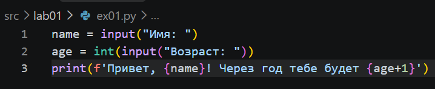
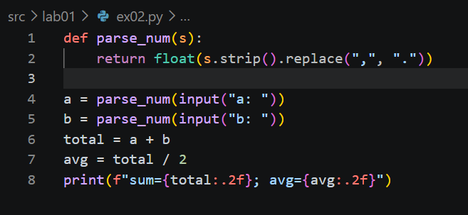
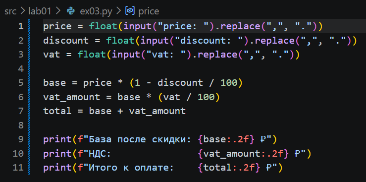
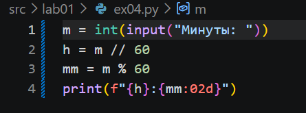
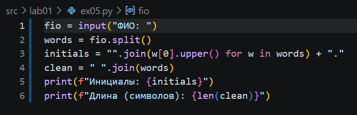

# python_labs

## ЛР1 — Ввод/вывод и форматирование

### Задание 1 — Привет и возраст

### Задание 2 — Сумма и среднее

### Задание 3 — Чек: скидка и НДС

### Задание 4 — Минуты → ЧЧ:ММ

### Задание 5 — Инициалы и длина строки
