## ЛР2 — Коллекции и матрицы

### **Задание 1 — arrays.py**

**min_max**

Программа:

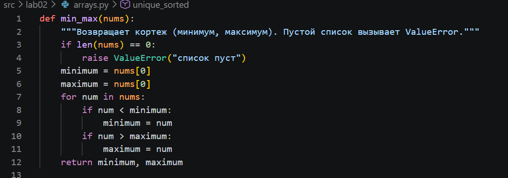

Запуск:

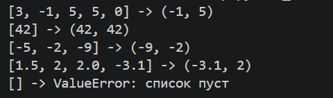

**unique_sorted**

Программа:

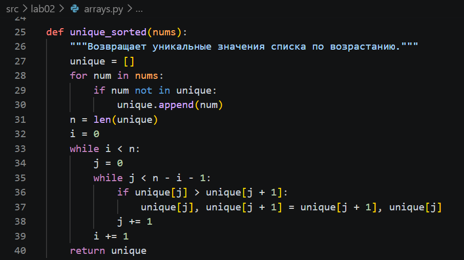

Запуск:

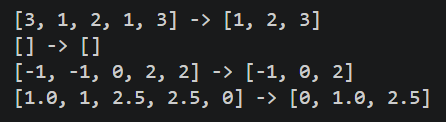

**flatten**

Программа:

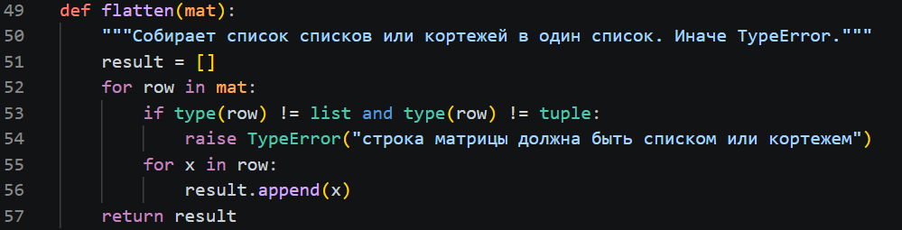

Запуск:

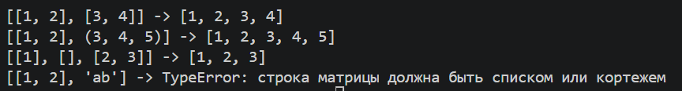

### **Задание B — matrix.py**
### **Вспомогательная функция для matrix.py**

**check_rect**

Проверяет, что все строки матрицы одной длины. Если нет, вызывает ValueError. Используется в transpose и row_sums.

Программа:

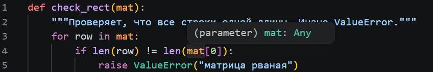

**transpose**

Программа:

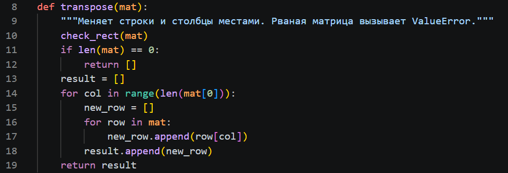

Запуск:

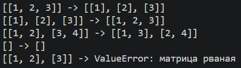

**row_sums**

Программа:

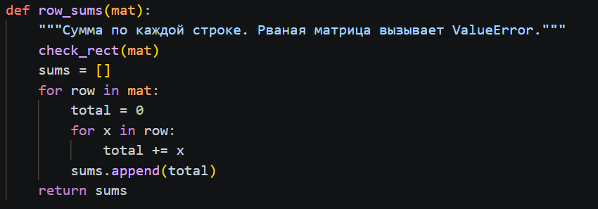

Запуск:

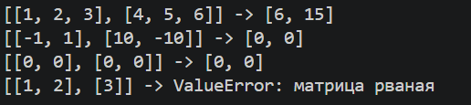

**col_sums**

Программа:

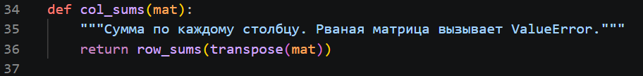

Запуск:

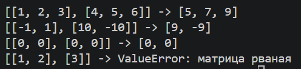

### **Задание C — tuples.py**

**format_record**

Программа:

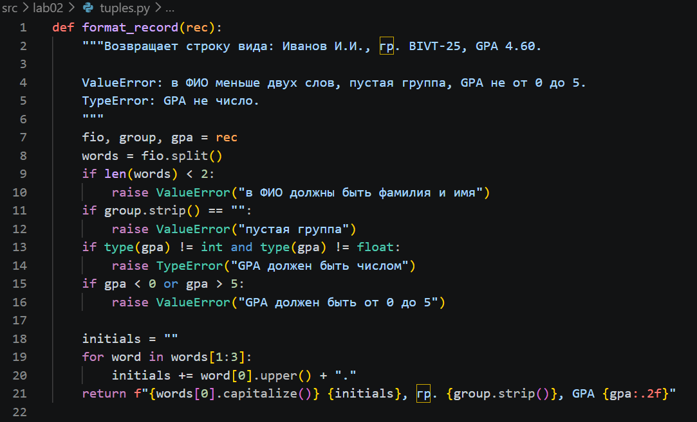

Запуск:

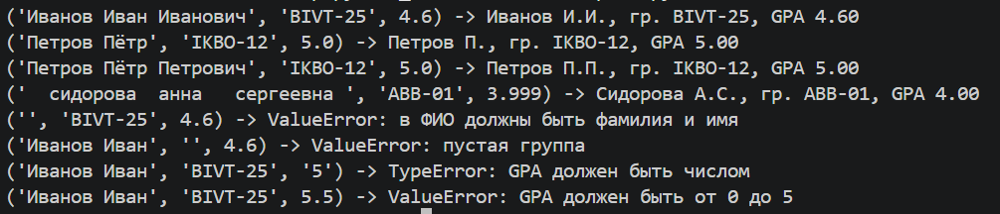