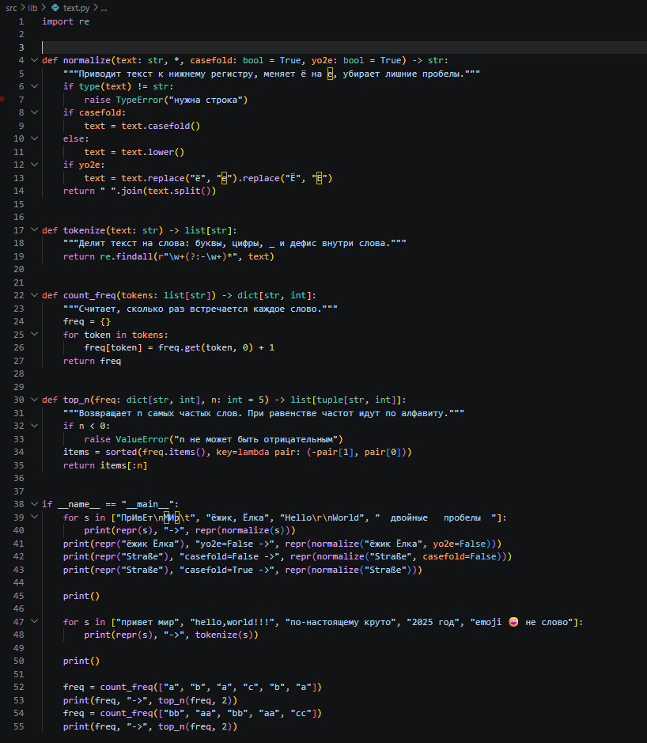
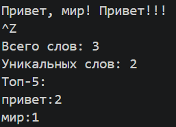
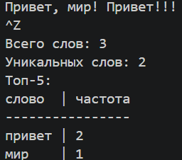

## ЛР3 — Тексты и частоты слов

### **Задание A — src/lib/text.py**

Программа:

Запуск:

### **Задание B — src/lab03/text_stats.py**

Скрипт читает весь ввод из stdin до конца (EOF).

Программа:

Запуск:

### **Дополнительно — табличный вывод**

